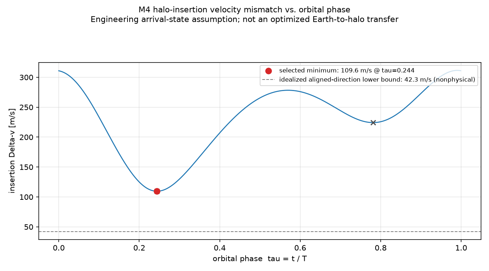
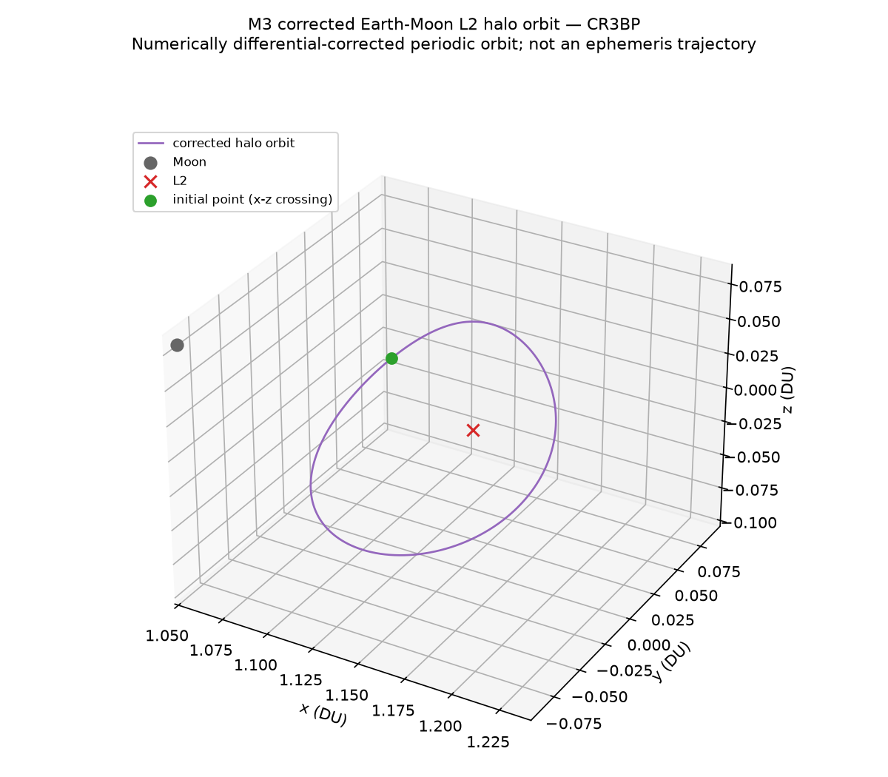
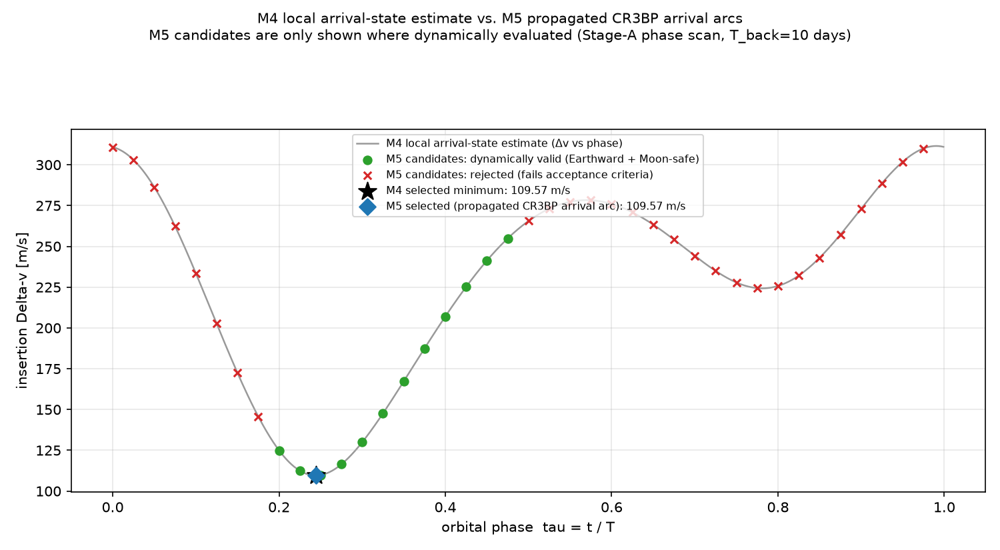
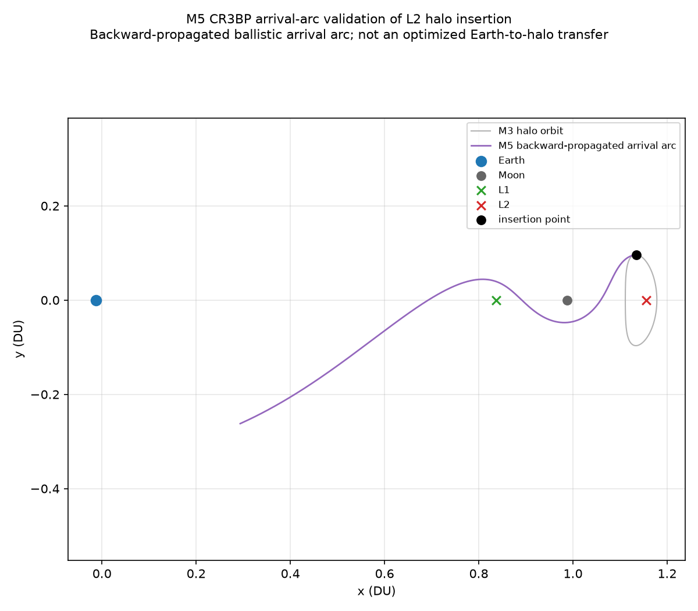

# Halo-Orbit Insertion Δv Estimate

**PORTFOLIO READY.** Earth–Moon L2 halo-orbit insertion Δv estimate
for a telescope-class spacecraft, built from a numerically corrected
CR3BP periodic orbit, a transparent local arrival model, and a
dynamically propagated validation arc — with 168 passing tests, full
provenance, and every headline number independently re-verifiable from
the committed code and data.

**Repository:** https://github.com/Sanjanakamboj/halo-orbit-insertion-estimate

---

## Project objective

Estimate the impulsive velocity-matching burn required to insert a
telescope-class spacecraft — arriving on an already-targeted transfer
trajectory — onto a representative Earth–Moon L2 halo orbit:

```
Delta_v = v_halo - v_arrival
```

This is deliberately scoped to **one specific quantity**: the burn at
the end of the transfer. It explicitly excludes launch Δv, translunar
injection (TLI), midcourse corrections, the Earth-to-L2 transfer Δv
itself, and stationkeeping. See [DESIGN.md §7](DESIGN.md#7-definition-of-insertion-δv-for-this-project)
for the full breakdown.

---

## Final result

> ## **≈ 110 m/s** halo-insertion Δv
> *(109.5723 m/s, both by local arrival-state assumption **and**
> independently by a dynamically propagated CR3BP validation arc — see
> below)*

**What this number is:** the local velocity-matching burn, at one
selected point and phase on a numerically corrected Earth–Moon L2 halo
orbit, under an explicit, documented arrival-state assumption
(Jacobi-consistent arrival speed, `dC = 0.01` nondim; radial-from-Earth
arrival direction), confirmed by embedding that exact state in a real,
backward-propagated CR3BP ballistic arc that reaches a predefined
Earthward screening region and round-trips to numerical precision.

**What this number is NOT:**
- **Not** total mission Δv (excludes launch, TLI, MCC, stationkeeping, disposal, reserves)
- **Not** an optimized Earth-to-L2 transfer (no launch/TLI trajectory was computed or optimized)
- **Not** a flight-design result (CR3BP only — no ephemeris, no Sun, no lunar eccentricity, no SRP, no finite burns)
- **Conditional** on the modeled arrival family — a different transfer architecture (different arrival Jacobi/direction assumption) would produce a different insertion Δv; the sensitivity studies below quantify this directly



---

## Engineering progression

| Milestone | What it established |
|---|---|
| **M1** | Mission framing, CR3BP derivation by hand, L2 location, insertion-Δv *definition*, order-of-magnitude Δv scale (10–200 m/s) — a **placeholder**, superseded quantitatively by M4/M5 |
| **M2** | Verified CR3BP dynamics in production code: equations of motion, Jacobi constant, L1/L2/L3 solved numerically (not hardcoded), a generic propagator |
| **M3** | **The first authoritative result**: a genuinely numerically differential-corrected periodic Earth–Moon L2 halo orbit — replacing M1's literature-scale placeholder, not merely relabeling it |
| **M4** | A transparent local arrival-state model, a dense phase sweep + bounded refinement over the M3 orbit, and sensitivity studies → **local insertion estimate ≈109.572 m/s** |
| **M5** | The M4 candidate state embedded in a real, backward-propagated CR3BP ballistic arc, screened against Earthward/Moon-clearance criteria fixed *before* searching, and round-trip verified → **≈109.572 m/s confirmed to round-trip precision; final technical estimate at this project's fidelity** |

Full derivations, equations, and milestone-by-milestone documentation
live in [DESIGN.md](DESIGN.md).

---

## Corrected halo orbit (M3)

| Quantity | Value |
|---|---:|
| z-amplitude (`z0` at symmetry crossing) | 0.035 DU = 13,454 km |
| max \|z\| over full orbit | 19,426.7 km |
| Period | 3.394396 DU-time = **14.740 days** |
| Jacobi constant `C_halo` | 3.1412189199162857 |
| Full-period closure (generic propagator, independent of the corrector) | 1.92×10⁻⁵ km position, 1.24×10⁻⁷ m/s velocity |
| Jacobi drift over one period | 4.06×10⁻¹² (nondimensional) |
| Monodromy dominant eigenvalue | 999.5 → linearly **unstable** (expected for a halo orbit; reported as a characterization, not a stationkeeping result) |



*Numerically differential-corrected periodic orbit (southern-convention,
`z0>0`); not an ephemeris trajectory.* Built via a linearized CR3BP seed
+ STM-based Newton differential correction (M3 uses a **linearized**
seed, explicitly *not* the third-order Richardson approximation — see
[DESIGN.md's M3 section](DESIGN.md#milestone-3--l2-halo-orbit-seed-differential-correction-stm-verification-and-periodic-orbit-validation)
for why, and for two genuine bugs found and fixed during implementation).

---

## Insertion estimate (M4)

| | |
|---|---:|
| Selected phase | `tau = 0.2441` (of the halo period) |
| Insertion epoch | ~3.60 days after the M3 reference crossing |
| Distance from Moon | 67,903 km |
| Distance from L2 | 38,303 km |
| **Δv magnitude** | **109.5723 m/s** |
| Δv vector (nondim) | [-0.075128, -0.019209, -0.073651] |

**Arrival-state assumption (explicit, not hidden):** arrival speed from
`v_arr² = 2·Ω(r_h) − C_arr`, `C_arr = C_halo − 0.01` (nondim); arrival
direction radial from Earth `(-μ,0,0)` to the insertion point. This is
**not** a propagated Earth-departure trajectory — it is a documented
engineering assumption, quantified by the sensitivity studies below.

**Two findings reported honestly, not smoothed over:**
- A **secondary local minimum** exists at `tau=0.781` (224.3 m/s) — reported, not discarded (see M5 below for why it matters).
- An **idealized aligned-direction lower bound** (direction exactly matching `v_halo`, a deliberately nonphysical degenerate case) gives 42.3 m/s — shown only as a sanity bound on the plot above, never as a meaningful insertion solution.

**Sensitivity:** the arrival-speed assumption (`dC` = 0.002–0.05 nondim)
moves the minimum Δv from 89.5 to 199.0 m/s; a ±20° arrival-direction
perturbation moves it only ~12 m/s (100.4–112.7 m/s) — direction
assumption reshapes *where* the optimum sits more than *how deep* it
is. The phase optimum is broad, not razor-thin: Δv grows only ~20 m/s
over ±17 hours around the selected phase.

---

## Dynamic validation (M5)

M4's arrival velocity was *prescribed*, not *generated* by an actual
trajectory. M5 asks: does a real CR3BP arc connect this exact state
toward Earth?

**Method — backward-propagated CR3BP ballistic arc:** take M4's exact
candidate pre-burn state, propagate it **backward** in time as a real
CR3BP trajectory, check it reaches a predefined Earthward screening
region while clearing the Moon by a conservative guard, then
**forward**-propagate the far end to independently recover the arrival
velocity (the mandatory round-trip check).

> **M5 validates the local insertion state by embedding it in a
> dynamically consistent CR3BP ballistic arrival arc that reaches the
> predefined Earthward region.** It does **not** prove this arc
> connects to a real launch state, parking orbit, or TLI maneuver —
> that connection is not established by this project (see Limitations).

| Criterion | Threshold | Selected arc |
|---|---:|---:|
| Earthward reach (screening only, not a physical boundary) | `< 0.8 DU` | 0.4027 DU ✅ |
| Moon clearance (deterministic geometric guard, not collision-risk analysis) | `> 8,687 km` (5 lunar radii) | 18,172 km ✅ |
| Round-trip position error | — | 2.65×10⁻⁶ km |
| Round-trip velocity error | — | 1.88×10⁻⁸ m/s |
| Jacobi drift along the arc | — | 7.89×10⁻¹¹ (nondim) |

| | Δv |
|---|---:|
| **M4** (local arrival-state assumption) | 109.57233088725141 m/s |
| **M5** (dynamically propagated, round-trip-verified) | 109.57233088250732 m/s |
| Difference | 4.7×10⁻⁹ m/s (4.3×10⁻⁹ %) |

**Classification: robust first-order estimate — M4 survives
validation to round-trip numerical precision.**



**The headline finding M5 adds, not just a confirming number:** M4's
*secondary* local minimum (`tau≈0.781`, 224.3 m/s) does **not** survive
— its backward arc never reaches closer than 0.959 DU to Earth at any
tested duration (10–120 days), well short of the 0.8 DU screening
threshold. **M4 alone could not distinguish the two branches; M5's
dynamical screening reveals a real difference between them.** This is
the central engineering argument for why M5 exists: minimizing local
velocity mismatch alone is not sufficient to identify a dynamically
meaningful insertion candidate.



*The backward-propagated arrival arc (purple) swings past L1 and near
the Moon before heading toward Earth — a real CR3BP trajectory, never
called an "Earth transfer" or "optimized transfer" anywhere in this
project, because neither has been demonstrated.*

---

## Propellant implication

**Illustrative insertion-burn propellant only** — for a representative
6,000 kg telescope-class spacecraft, using the rocket equation on the
final 109.5723 m/s estimate (M4 and M5 propellant values agree to
~10⁻⁸ kg):

| Isp | Propellant |
|---:|---:|
| 320 s | 205.88 kg |
| 450 s | 147.14 kg |

**This is not a spacecraft propellant budget.** It excludes launch,
TLI, MCC, stationkeeping, disposal, reserves, and finite-burn losses —
insertion burn only, everywhere in this project.

---

## Verification

- **168 tests pass**, `pytest -W error`, zero warnings, clean install
  from a fresh virtual environment (see Reproducibility below).
- **Deterministic regeneration:** M3/M4/M5 numerical results (`results/*.json`,
  `*.csv`) reproduce byte-identically across repeated runs — verified
  directly, not assumed.
- **Independent verification, not plot-based confidence**, at every
  milestone: analytic-vs-finite-difference gradient/Hessian checks, an
  independently-coded acceleration cross-check (agrees to 10⁻¹⁵), STM
  short-time perturbation prediction (scales as `eps²`, confirmed),
  full-period orbital closure via a generic propagator independent of
  the differential corrector, Jacobi conservation on every unforced
  trajectory (10⁻¹¹–10⁻¹² level), tighter-tolerance and alternate-
  integrator (RK45 vs. DOP853) cross-checks, and the M5 backward→forward
  round-trip closure (10⁻⁶ km / 10⁻⁸ m/s).
- **Numerical convergence studies** (loose/medium/tight tolerances) at
  M2, M3, and M5 — monotonic, multi-order-of-magnitude improvement at
  each level, never a single-tolerance claim.
- Every headline number in this README was independently recomputed
  from the committed code and `results/` artifacts during the M6 audit
  — not copied from an earlier draft.

---

## Limitations

- **CR3BP only** — circular, coplanar Earth–Moon orbits; no Sun
  perturbation; no lunar orbital eccentricity; no solar radiation
  pressure; no ephemeris model.
- **Impulsive maneuvers only** — no finite-burn modeling.
- **The Earthward criterion (M5) is a screening threshold, not a
  physical Earth-departure boundary.** The Moon-clearance guard is a
  deterministic geometric guard, not a collision-probability analysis.
- **The M5 arrival arc's far end is not connected to a launch state, a
  parking orbit, a TLI maneuver, or a real ephemeris transfer.** This
  project estimates halo insertion for a dynamically consistent
  arrival family — it does not solve the complete Earth-to-L2 mission
  transfer. This is the project's most significant remaining scope
  boundary, stated prominently rather than left implicit.
- No stable/unstable manifold design, no launch-vehicle or TLI
  optimization, no stationkeeping design, no navigation/dispersion or
  covariance analysis, no operational flight-design claim.
- **The ≈110 m/s value is conditional on the modeled arrival
  Jacobi-offset/direction family** (Section "Insertion estimate"
  above). A different transfer architecture can produce a materially
  different insertion requirement — this is quantified, not asserted,
  by the sensitivity studies in M4 and M5.

Full list: [DESIGN.md §12](DESIGN.md#12-limitations).

---

## Reproducibility

```bash
git clone https://github.com/Sanjanakamboj/halo-orbit-insertion-estimate.git
cd halo-orbit-insertion-estimate
python3 -m venv .venv && source .venv/bin/activate
pip install -e ".[dev,figures]"

pytest -W error                        # 168 tests

python scripts/build_m3_halo.py        # regenerate the corrected halo orbit
python scripts/build_m4_insertion.py   # regenerate the local insertion estimate
python scripts/build_m5_validation.py  # regenerate the dynamic validation

python scripts/make_m2_figures.py
python scripts/make_m3_figures.py
python scripts/make_m4_figures.py
python scripts/make_m5_figures.py
```

The `build_*` scripts write to `results/*.{csv,json}` and reproduce the
committed values byte-for-byte (verified during the M6 audit in a
fresh environment). Figure PNGs may differ at the byte level across
matplotlib/OS versions (rendering, not numerical, nondeterminism); the
underlying numerical data does not.

---

## Repository structure

```
DESIGN.md                       full derivations, equations, milestone-by-milestone documentation
README.md                       this file
LICENSE                         MIT
.github/workflows/ci.yml        CI: pytest on Python 3.11 and 3.12
pyproject.toml                  package metadata and dependencies
src/halo_insertion/             constants, normalization, CR3BP dynamics, equilibria,
                                 propagation (M2); variational/STM, halo seed, differential
                                 correction, halo orchestration (M3); arrival-state model,
                                 insertion phase sweep/refinement (M4); backward arrival-arc
                                 propagation and round-trip check (M5)
tests/                          pytest suite (168 tests)
scripts/                        build_m3_halo.py, build_m4_insertion.py,
                                 build_m5_validation.py (numerical drivers);
                                 make_m{2,3,4,5}_figures.py (figure generation)
figures/                        M2-M5 diagnostic and headline figures
results/                        m3_halo_*.{csv,json}, m4_*.{csv,json}, m5_*.{csv,json}
```

---

## Final figure hierarchy

**Primary (portfolio headline):**
1. [M3 — corrected L2 halo orbit, 3D](figures/m3_fig1_halo_orbit_3d.png) — the target orbit was generated numerically, not assumed.
2. [M4 — insertion Δv vs. halo phase](figures/m4_fig1_delta_v_vs_phase.png) — insertion location matters; quantifies the local minimum.
3. [M5 — propagated arrival arc + halo](figures/m5_fig1_arrival_arc.png) — the local M4 state belongs to a dynamically consistent CR3BP arc.
4. [M5 — M4-vs-M5 comparison](figures/m5_fig2_m4_vs_m5.png) — shows which local minima survive dynamic screening.

**Supporting/diagnostic** (technical evidence, not headline claims):
M2 equilibrium geometry and Jacobi-conservation figures, M3 orbit
projections and correction-convergence figure, M4 insertion-point
vector diagram and sensitivity figure, M5 sensitivity/convergence
figure — all in `figures/`, referenced throughout [DESIGN.md](DESIGN.md).

---

## What this project demonstrates

- **Engineering judgment about model fidelity**, not just code: a
  literature-scale halo placeholder (M1) was explicitly not treated as
  ground truth — it was replaced by a genuinely differential-corrected
  numerical orbit (M3), and a local insertion estimate (M4) was not
  trusted by itself — it was independently embedded in and validated
  against a dynamically propagated trajectory (M5).
- **Distinguishing a mathematical optimum from a dynamically
  meaningful one**: M4's secondary local Δv minimum looked equally
  valid by local criteria alone; M5's dynamical screening showed it
  isn't — and that distinction is reported as a primary finding, not
  buried.
- **Numerical honesty under a null/negative result**: when a
  Jacobi-offset case tripped the Moon-clearance guard, or a phase
  branch failed the Earthward criterion, that was reported as data,
  not adjusted away.
- **Verification as a first-class deliverable**: every stage carries
  independent checks (analytic-vs-finite-difference, alternate
  integrators, round-trip closure, Jacobi conservation, convergence
  studies) — confidence built from cross-checks, not from a plot
  looking reasonable.
- **Precise scope discipline**: this README and DESIGN.md consistently
  distinguish insertion Δv from TLI/MCC/stationkeeping/total mission
  Δv, and a dynamically-valid arrival arc from a validated Earth
  transfer — distinctions that are easy to blur and are not blurred
  here.
