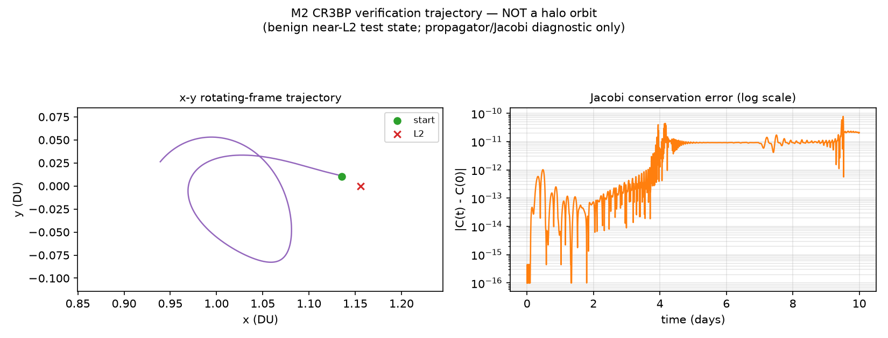

# Halo-Orbit Insertion Δv Estimate

**Portfolio deliverable:** Halo-orbit insertion Δv estimate for an
Earth–Moon L2 telescope-class mission, with clearly stated assumptions
and a concrete verification plan.

**Status: Milestone 2 (M2) complete. M3 (Richardson analytical halo
seed + differential correction to a periodic orbit) not started.**

Full derivations, equations, and assumptions live in [DESIGN.md](DESIGN.md).
This README summarizes the current state.

---

## Objective

Estimate the impulsive Δv required to insert a telescope-class
spacecraft, arriving on an already-targeted transfer trajectory, onto a
representative Earth–Moon L2 halo orbit.

## What "insertion Δv" means here

At a chosen point near the target halo orbit:

```
Delta_v = v_halo - v_arrival
```

This is **only** the velocity-matching burn at the end of the
transfer — it explicitly excludes launch Δv, translunar injection,
midcourse corrections, the Earth-to-L2 transfer Δv itself, and ongoing
stationkeeping. See [DESIGN.md §7](DESIGN.md#7-definition-of-insertion-δv-for-this-project)
for the full breakdown of each term.

## M1 reference scenario

| | |
|---|---|
| System | Earth–Moon |
| Destination | L2, southern halo family |
| Spacecraft class | Telescope-class observatory |
| Wet mass | 6,000 kg |
| Maneuver model | Single impulsive burn |
| Arrival assumption | Transfer already targeted near the halo insertion region |

## Halo family / seed status

The target orbit is currently a **halo-orbit seed** (literature-scale
placeholder amplitude/period, southern L2 family) — **not** a
numerically corrected periodic orbit. That correction step is M3.
See [DESIGN.md §2](DESIGN.md#2-reference-halo-family-member-m1-seed).

## Key normalization constants (Earth–Moon CR3BP)

```
mu  = 0.0121505839          (mass ratio)
DU  = 384,400 km            (distance unit)
TU  = 4.342480 days         (time unit)
V*  = 1024.547 m/s          (characteristic velocity)
```

## L2 location

```
x_L2 (nondimensional)      = 1.1556821589
distance from Moon center  ≈ 64,515 km
distance beyond Moon surface ≈ 62,778 km
```

Consistent with the expected ~60,000–70,000 km-beyond-Moon range for
Earth–Moon L2. Derivation: [DESIGN.md §6](DESIGN.md#6-l2-location).

## M2: CR3BP dynamics, equilibrium points, propagation (production code)

M2 implements and verifies the normalized Earth–Moon CR3BP: effective
potential/gradient, equations of motion, Jacobi constant, a numerical
L1/L2/L3 solver, and a generic propagator. Full details:
[DESIGN.md — Milestone 2 section](DESIGN.md#milestone-2--cr3bp-dynamics-equilibrium-points-propagation-and-jacobi-verification).

**No halo orbit exists yet** — this is generic, halo-agnostic CR3BP
infrastructure only.

Equilibrium points, solved numerically (not hardcoded) via `brentq`:

| Point | x (nondim) | Residual | Distance from Moon |
|---|---:|---:|---:|
| L1 | 0.8369151341 | 2.2e-16 | 58,019.138 km |
| L2 | 1.1556821589 | 1.9e-14 | 64,514.906 km |
| L3 | -1.0050626451 | 5.0e-16 | 766,075.396 km |

L2 reproduces the M1 hand value to 10 decimal places. Verification
highlights: Jacobi conservation to `<2e-11` over a 10-day test
trajectory (see figure below), equilibrium states stationary under
propagation to numerical round-off (L2's mild ~1.8e-8 drift over 30
days reflects its known dynamical *instability*, not an error), an
independent from-scratch acceleration cross-check agreeing to
`1.3e-15`, and a 3-tolerance convergence study showing monotonic
improvement. 85 tests pass.



*A benign non-equilibrium test trajectory near L2 — explicitly NOT a
halo orbit — used only to exercise the propagator and Jacobi
diagnostic.*

## Preliminary insertion-Δv expectation (**M1, not yet computed — a regression bound only**)

Two independent M1 hand estimates (literature order-of-magnitude +
local velocity-mismatch scaling) both point to:

> **O(10¹–10²) m/s — tens to low hundreds of m/s, not km/s.**

This is **not** a final answer. It exists so that M4's actual computed
Δv (from real propagated/corrected states) has something to be sanity
checked against. See [DESIGN.md §7](DESIGN.md#7-definition-of-insertion-δv-for-this-project).

## Illustrative propellant cost (6,000 kg spacecraft)

| Δv (m/s) | Isp=320s | Isp=450s |
|---:|---:|---:|
| 25 | 47.6 kg | 33.9 kg |
| 50 | 94.8 kg | 67.6 kg |
| 100 | 188.2 kg | 134.4 kg |
| 150 | 280.1 kg | 200.5 kg |

Illustrative only — no propulsion architecture is finalized.

## Milestone roadmap

| Milestone | Scope |
|---|---|
| **M1 ✅** | Mission definition, CR3BP derivation, L2 calculation, insertion-Δv definition, hand estimates |
| **M2 ✅** | CR3BP integrator, equilibrium-point solver, Jacobi conservation verification |
| M3 (next) | Richardson analytical halo seed + differential correction to a periodic orbit |
| M4 | Arrival-state model + insertion-point Δv calculation + sensitivity study |
| M5 | Trade study: halo size, insertion point, transfer geometry, propellant implications |
| M6 | Independent validation, convergence study, final figures, portfolio packaging |

## Limitations (see [DESIGN.md §12](DESIGN.md#12-limitations) for the full list)

CR3BP only — circular/coplanar Earth–Moon orbits, no Sun perturbation,
no lunar eccentricity, no solar radiation pressure, no ephemeris model,
no finite-burn modeling, no launch/transfer optimization, no
stationkeeping design, no navigation/dispersion or covariance analysis.
**This is an engineering-approximation estimate, not a flight
trajectory solution.**

## Running tests

```bash
pip install -e ".[dev]"
pytest -W error
```

85 tests pass as of M2: constants/normalization round-trips, CR3BP
potential/gradient/RHS validation (including an independent from-scratch
acceleration cross-check and symmetry checks), L1/L2/L3 equilibrium
residuals, Jacobi-constant identities, and propagation/convergence
checks. No halo-specific tests exist yet — those begin at M3.

## Repository layout

```
DESIGN.md                    full derivations, equations, assumptions
README.md                    this file
src/halo_insertion/          package: constants, normalization, CR3BP
                              dynamics, equilibria, propagation (M2)
tests/                       pytest suite (85 tests as of M2)
scripts/make_m2_figures.py   generates the M2 diagnostic figures
figures/                     M2 diagnostic figures (equilibrium
                              geometry, verification trajectory/Jacobi)
results/                     numerical results (empty through M2)
```
